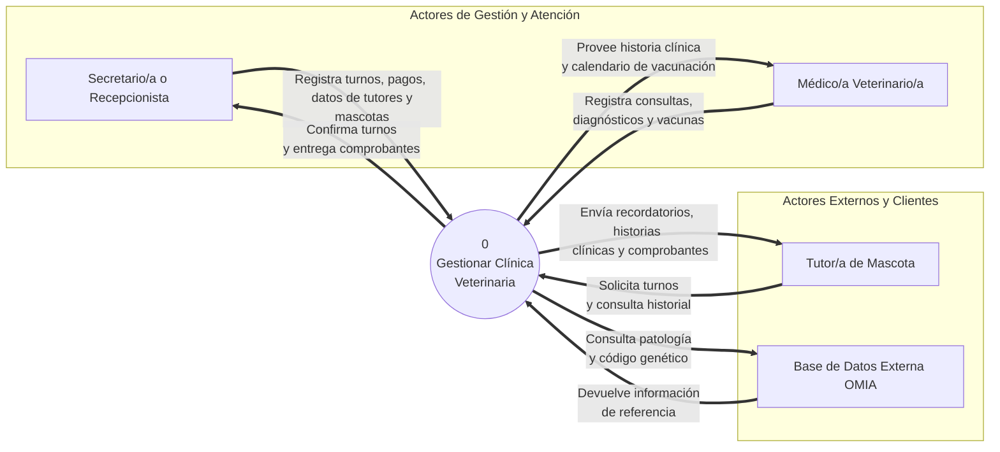
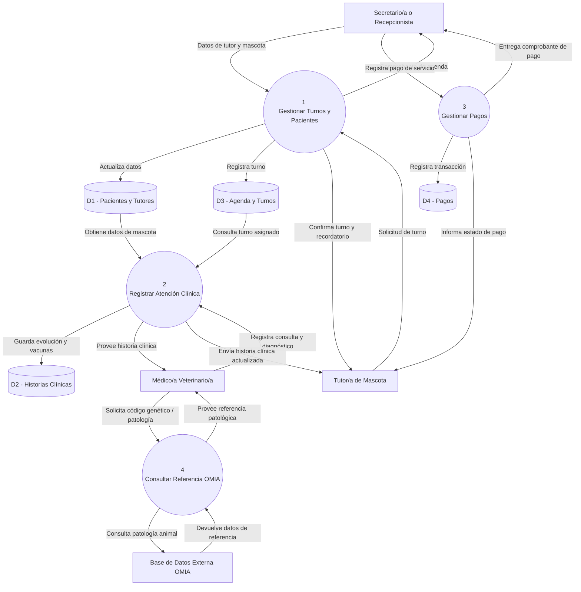

# Diagrama de contexto — Sistema de Gestión Veterinaria

El sistema completo se representa como un único proceso (0), con sus entidades externas y los flujos de datos entre ambos, siguiendo la notación DFD Nivel 0 descripta en el instructivo de cátedra.



**Entidades externas identificadas:**

- **Secretario/a o Recepcionista**: gestiona turnos, datos de contacto de tutores/mascotas y pagos.
- **Médico/a Veterinario/a**: registra consultas, diagnósticos y aplicaciones de vacunas; consulta patologías.
- **Tutor/a de Mascota**: solicita turnos y consulta información de su(s) mascota(s).
- **Base de Datos Externa OMIA**: fuente de referencia externa sobre patologías y código genético animal (consulta de solo lectura, no se sincroniza como base propia — ver justificación en `docs/requirements/srs.md`, sección 1.6).

> 

## Checklist de verificación (según el instructivo)

- [x] Hay un único proceso, numerado 0, nombrado con verbo + objeto ("Gestionar Clínica Veterinaria").
- [x] No aparecen almacenes (corresponden a Nivel 1, fuera de alcance de esta materia).
- [x] Las 4 entidades externas tienen nombres significativos y concretos (dentro del rango de 4-6 que sugiere el instructivo).
- [x] No hay flujos sin etiqueta.
- [x] Todos los terminadores se conectan únicamente al proceso central, no entre sí.
- [x] Cada flujo tiene su contraparte lógica en sentido inverso (ej. el/la secretario/a registra pagos y recibe comprobantes; el sistema consulta OMIA y recibe la información de vuelta).
- [x] El diagrama está en un bloque ` ```mermaid ` dentro de este `.md`, no como imagen.

# Descomposición funcional (DFD Nivel 1)

Descomponemos el proceso central 0 en 4 subprocesos lógicos:

1. Gestionar Turnos y Pacientes (maneja la agenda, admisión y registros iniciales).

2. Registrar Atención Clínica e Historial (maneja consultas, diagnósticos, vacunas y relación con OMIA).

3. Gestionar Pagos y Cobranzas (controla los pagos y comprobantes).

4. Administrar Usuarios y Permisos (gestión interna del sistema).


